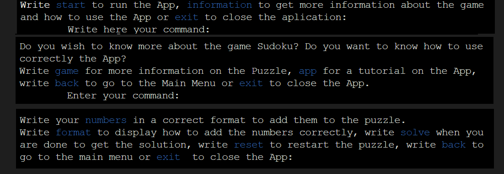
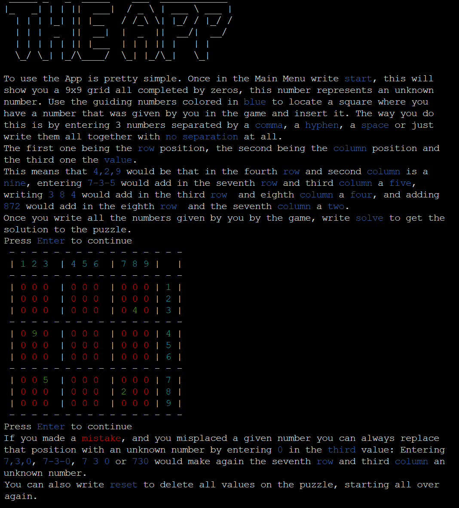
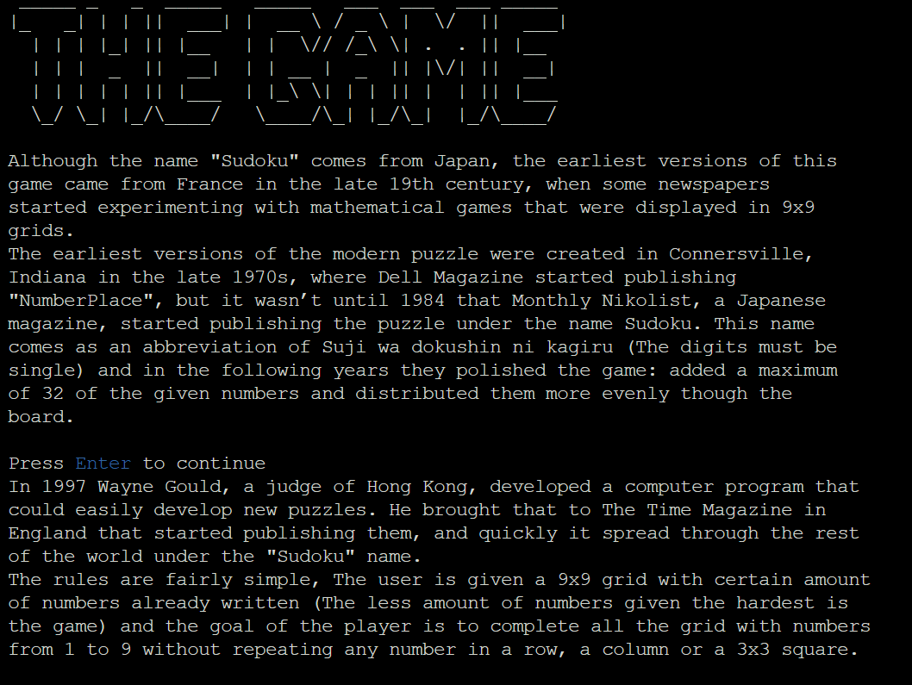
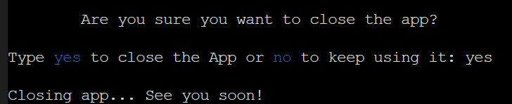
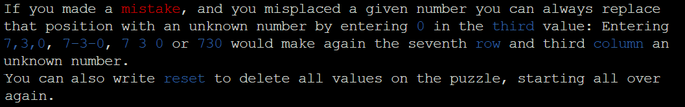
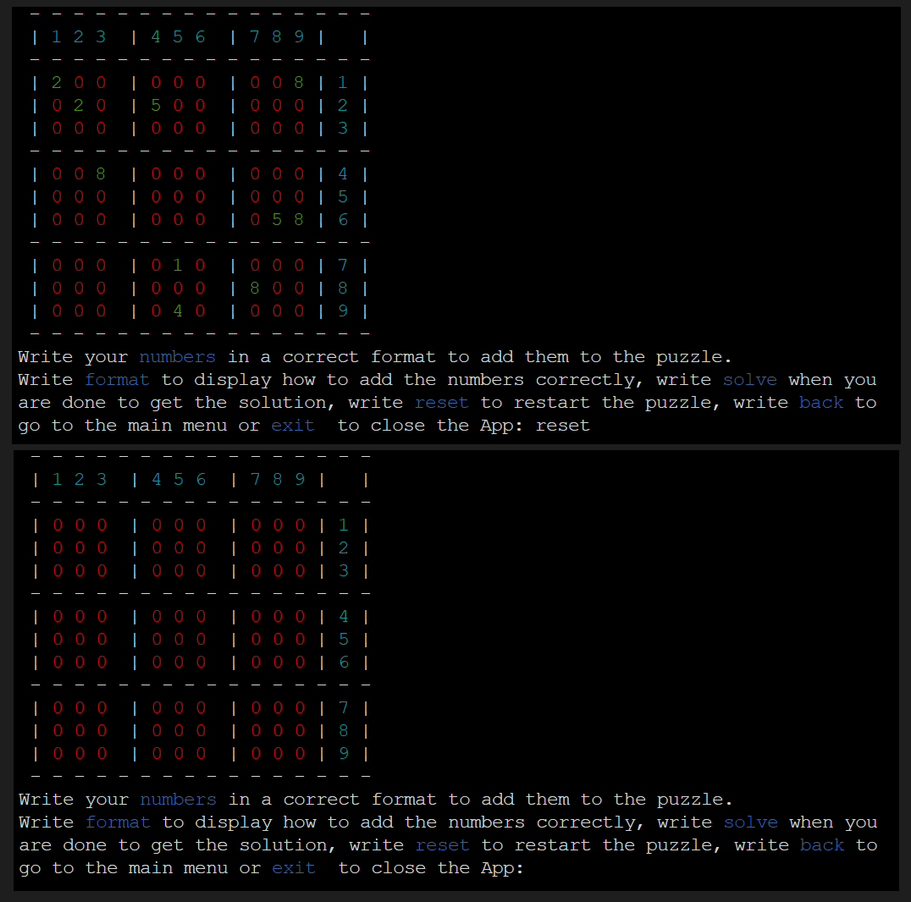
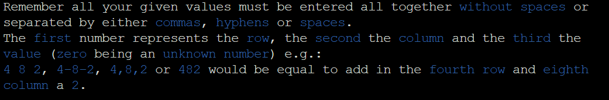
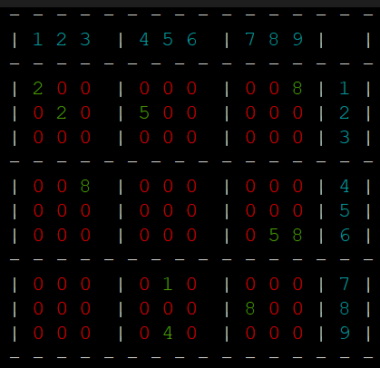
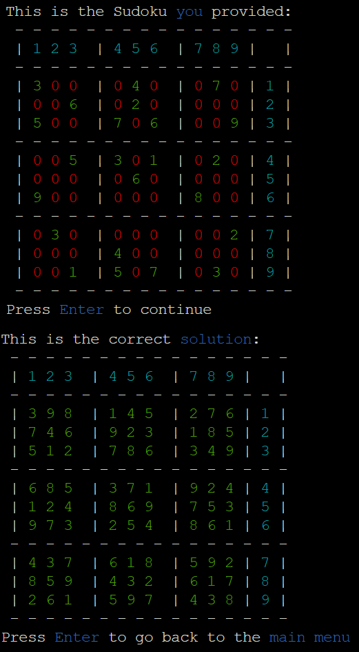

# Testing
Click to return back to the [README.md](README.md)

## Code Validation
The code was validated using the pycodestyle validator directly in the GItpod terminal. This does not throw any code errors.

View Validator

## User Stories
* As a user, I want to intuitively navigate through the application.
    * The app makes sure to always explain to the user what inputs can be entered.

View Screenshot

* As a user, I want to be explained how to use the application.
    * The app has a tutorial that explains what the user can do within the application.

View Screenshot

* As a user, I want to get information about the game Sudoku.
    * The app explains the history and rules of the game.

View Screenshot

* As a user, I want to be able to exit the application at any step.
    * In any input, the user can enter "exit" to run the exit app function and close the app.

View Screenshot

* As a user, I want to be able to correct the puzzle in case I make a mistake.
    * The user can override any entered number if they make a mistake by just entering a new "given value" or a zero for an "unknown number".

View Screenshot

* As a user, I want to be able to restart the whole puzzle if I make a lot of mistakes.
    * The user can enter "Reset" to delete all values from the puzzle.

View Screenshot

* As a user, I want to be able to enter the sudoku values using more than just one format.
    * The user can enter the puzzle in four different formats, so they can select what is easiest for them.

View Screenshot

* As a user, I want to have the numbers I enter easily differentiated from the others.
    * The style board function easily differentiates between given and unknown numbers.

View Screenshot

* As a user, I want to get the solution to the Sudoku puzzle.
    * If the puzzle provided has a solution, the application will print this into the terminal.

View Screenshot

## Resolved Bugs
During the creation of this application many bugs were found that affected the applications functionalities:
* The first one was that after printing the function style board, this would print a message of "None" after the puzzle. This happened because the function style board already had a print function inside and using the function print on the style board would make the application not run as expected. After realizing this error, I switched to just calling the function style board to print the result.

View Bug

* The second bug occurred during the validation in the run app function. Originally, this function just ran as a bunch of is and elif statements that validated if the user entered a specific word or a set of numbers with a specific format, but this would throw an error message. This error was fixed during a tutor session. He recommended using a try/except block to validate the numbers (and actually to create a validation function to make the code clearer) and then using the except block for all the other input options.

View Bug

* When the solve sudoku function starts running, the first thing it does is make a copy of the puzzle (the nested list with the puzzle values). The reason it does this is so the application resolves the copy and it can still print the original unchaged puzzle before printing the solution. When first copying the list, though, I found that changing the copy would also affect the original. I fixed this by learning about how to implement a "deepcopy" and applying this to the original puzzle to clone it and modify the copy without changing the original.

* When validating the puzzle, I realized that the sudoku solving algorithm would not check if the user entered a wrong number combination (It would still find an answer if the user entered 2 same numbers in a row, column, or 3x3 square). To solve this, I created a function that would check if a number was repeated and throw an error to the user if that was the case.

## Unfixed Bugs
The only unfixed bug that I am aware of happens only on the heroku terminal, not on the gitpod or other terminals. Because of the limitations of the provided terminal emulator, the application does not run the clear function properly, and this causes some chunks of previous code to still appear on top of the current code (although to see this the user would have to scroll up).